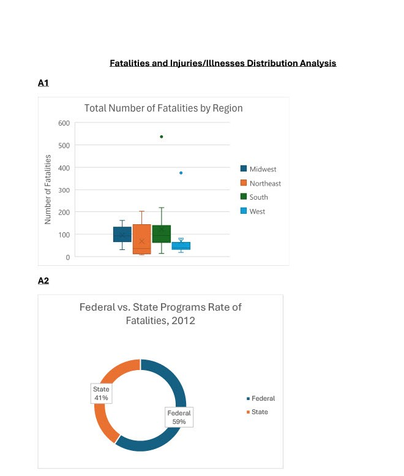
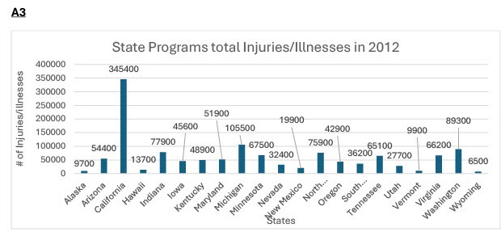
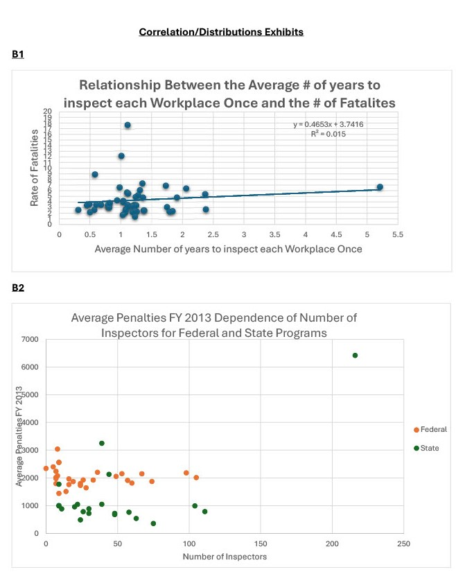

# 2012-Workplace-Fatalities-by-State-Data-Analysis

**Author:** Angelica Butler

**Intructor:** James Meredith

**Institution:** UTA QuickStart Bootcamp March 2024 Cohort

Active Project Dates: April 23, 2024 - May 2, 2024

***

 

## Abstract

This project aims to explore the 2012 Workplace Fatalities by State dataset. By delving into the various elements of this dataset, users can comprehend the diverse factors and relationships that yield valuable insights. The dataset utilized in the project encompasses specific workplace variables from all states in the United States. These variables include, but are not limited to, the total and rate of fatalities per state, the total and rate of injuries/illnesses per state, as well as the categorization of states by program types. This dataset was employed to conduct descriptive statistical analysis. Additionally, I addressed several prominent questions from the dataset while presenting the results through data visualization tools.

## Business Problem

Workplace fatalities and injuries/illnesses are very important topics. Identifying the most impacted state is crucial in implementing measures to decrease rates nationwide. Prioritizing workplace safety benefits both employers and employees across various organizations. This analysis emphasizes the role of Federal and State-run programs in addressing fatalities and injuries/illnesses within workplaces by state. By focusing on the variables potentially contributing to increased rates, we can pinpoint states needing to review workplace regulations and policies.

## Data

The dataset used for this project was the 2012 Workplace Fatalities by State. This data was obtained directly through the school portal and made available by the instructor. In this project, I had to manipulate the data to create a clear format. The cleanup aspects help determine which variables are the most important in the dataset and which variables we should exclude. In addition to the data provided, I also included an additional column for a more in-depth analysis comparison. To provide a more comprehensive analysis, I added the “Region” column to help break out the data into a more consolidated view.  Please note that the original data is saved separately from the manipulated data to be able to distinguish the changes that were made.

## Methods

The dataset was manipulated by adding and deleting necessary columns to organize the information in a table or pivot table. Filters and slicers were used to summarize and query only the needed information. Following this, a statistical analysis of the dataset was performed. Additionally, a series of visualization models, including pie charts, histograms, bar graphs, and scatter plots, were created to complete the additional analysis and address the main objectives of the dataset.

## Conclusion/Results

Based on the analysis, significant components within the dataset have been identified. Among the two types of programs, federal programs have the highest rate of fatalities, exceeding state programs by 18% (exhibit A2). One factor contributing to this disparity may stem from the prevalence of federal programs across more states within the dataset. 
California was also identified as the state program with the highest number of injuries/illnesses (exhibit A3). While it cannot be determined with 100% certainty, the trend for this may be attributed to the state's workforce density per capita.  
Because the dataset contains several important variables, it was crucial to identify the interdependent variables. Following a correlation analysis, it was determined that there is a positive relationship between the "Average number of years to inspect workplace once" and the "Number of Fatalities" (exhibit B1). The correlation suggests prolonged workplace inspection intervals correspond to higher fatality rates. One can indicate this could be due to an organization becoming lenient with policies and procedures; in return, employees could become negligent. However, the dataset does have three outliers (Alaska, North Dakota, and Wyoming). Those three states have very high fatality rates even though the average number of years to inspect a workplace once is under 1.5 years. Further context could clarify whether these anomalies stem from typical job hazards or unique work settings.

Further analysis also identified the top five states with the highest average penalties: California, Kentucky, North Dakota, Arkansas, and Nebraska (See excel file). This indicated that this ranking does not solely align with total fatality or sickness/injury figures, implying that the nature or circumstances of incidents could also influence penalty averages. 
Lastly, an examination was completed to determine if there was an interdependent relationship between the “Average Penalties FY 2013” and the “Number of Inspectors” (exhibit B2). The analysis concluded a positive relationship between the “Average Penalties FY 2013” and the “Number of Inspectors” by state and program type. This correlation indicates that dedicating more resources or deploying additional personnel for inspections results in higher penalty fees, consequently impacting the total penalties incurred.

The analysis uncovered valuable insights from the dataset, but expanding it with more variables could have deepened overall understanding. For instance, incorporating data from multiple years and refining details such as categorizing workplaces by industry or identifying worksite numbers per state would have enriched our analysis. Another important consideration is the presence of null values, which can significantly affect the accuracy of our findings. The results could have changed or significantly impacted the findings if the null values were accurate data.  
In summary, while our analysis offers a broad perspective, it's crucial to recognize its limitations. By broadening our scope through additional variables, we could uncover more contextual insights.

Please see the Excel file titled **_2012 Workplace Fatalities by State Analysis by Angelica Butler._**

 

 

 
